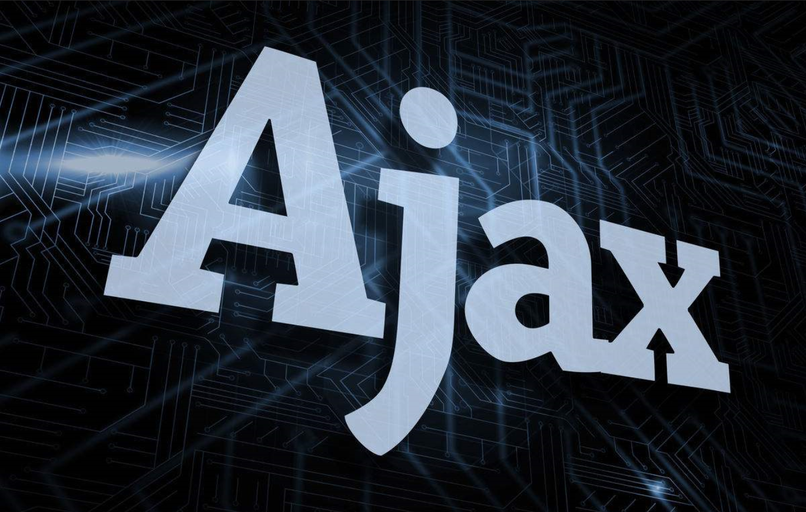

叫个的测试文章
HELLO各位，经常接触海外营销的应该都对affiliate--联盟营销商这个词不陌生，不管是在亚马逊、速卖通这些平台有专门的affiliate （associate） program，还是在各个独立站点的footer（网站底部）都会看到对应的affiliate program。今天叫个就与各位聊聊关于affiliate的那些事儿。
本篇文章将从
1. 什么是联盟营销？
2. 联盟计划的好处
3. 联盟计划的缺点
4. 联盟营销人员赚多少钱？
5. 联盟营销如何运作？
6. 如何成为联盟营销商
7. 后续步骤：最大化联属网络营销收入
几个方面从个人经验分享一些看法~欢迎加入讨论，也许对各位的海外网赚或者营销可以提供一些新的思路！

什么是联盟营销？
联盟营销是指联盟用户（affiliate）通过推广他人（企业或者个人零售商）的产品赚取佣金。简单点解释就是：affiliate产生销售时，他们会收到对应的佣金报酬

Affiliate program是博主或者其他内容创作者通过利用他们的受众为品牌或网站做广告来赚取被动收入的绝佳方式。所有affiliate所要做的就是搜索他们喜欢的产品，对其进行推广，并从他们所做的每笔销售中赚取一定比例的利润。 通过附属链接跟踪销售情况。

联盟营销计划同样也是有利于企业的，因为在许多企业中15-30% 的销售额来自推荐计划（佣金或者拉新返现模式）。其实说到这，即使没有接触过国外跨境，或者对联盟营销这个词不甚熟悉的朋友，也会联想到国内常见的“淘客”模式，比如微博的“省钱xx君”，或者可以自己复制某个商品链接再去某个网站下单后可以得到返现“cashback”，亦或是养猫朋友经常会加入的猫车群--可以找到内部优惠券并且以优惠价格下单。在这样的链路当中，企业获得销售额，联盟成员获得佣金，客户也可以以稍低的价格购买商品。看起来是一个win-win result 的操作方式，那么事实真的如此么？
[图片]
1. Consumer: 顾客
2. Publisher/affiliate marketer:他们通过推荐产品来影响他们的受众。 每当消费者从广告商那里购买产品时，他们就会赚取收入。
3. Advertiser/ the seller/merchant/retailer: 他们的目标是进行销售，同时让更多人了解他们的产品。
联盟计划的好处
现么是联属网络营销，以下是您应该学习如何成为联属网络营销商的几个原因：

无成本投入的收入：只需要注册附属网站（affiliate program）并设置广告系列。 完成后，当客户使用您的会员链接购买您推荐的商品时，您将不断赚钱。在这样的方式当中，你不需要囤货，也不需要核算成本，就可以拿到你的佣金（commission）
多渠道：可以通过社交媒体帐户、电子邮件列表和网站从中进行变现获利。
门槛低：联盟营销是一种低门槛进入业务。 大多数联属网络营销计划没有注册费——创建一个帐户并开始赚钱。
无需专业知识：您不需要特殊技能即可成为联盟营销商。 搜索引擎优化 (SEO) 或数字营销的基本知识可能会有所帮助，但联盟营销的可以让你一直处于学习和测试。
方便和灵活：您不必坚持一个联属网络营销计划——您可以创建多个活动并且可以远程工作。

联盟计划的缺点 （drawbacks）
虽然成为联盟营销商有很多优势，但叫个认为天下所有的事都有正反面，所以从非常客观的层面对于目前跃跃欲试的大伙儿提一下这件事儿的缺点。

在合作当中处于被动关系：取决于商家的规则和条件（如商家制定的commission rate, cookie days, 还有对应的违规限制条例 （ppc限制）等等，关于商家端如何对联盟成员进行限制以后我会分享~）。 所以如果你想赚更多的钱，你必须有选择性地选择你选择的伙伴关系。

不会一夜之间就能赚钱：如果没有足够的粉丝量，一开始可能收入很少或者直接没有收入，这是一件需要持之以恒的事情，在你的变现渠道中，无论是做博主还是使用其他的引流方式，都需要不断的进行优化。所以这是一件适合一开始当做副业的活儿，在你得到良好的回报之前，最好不要把整个当做你的收入来演

竞争：由于进入门槛低，许多人注册成为联盟营销人员。

在大多数联盟营销计划中，10% 的联盟贡献了 90% 的销售额。学习成为联盟营销人员仍然是值得的， 2022 年的数据统计，仅美国联盟成员带来的的支出就将超过 80 亿美元——几乎是十年前的三倍。
 
关于：
4. 联盟营销人员赚多少钱？
5. 联盟营销如何运作？
6. 如何成为联盟营销商
7. 后续步骤：最大化联属网络营销收入
看下回分享啦！ See u~
